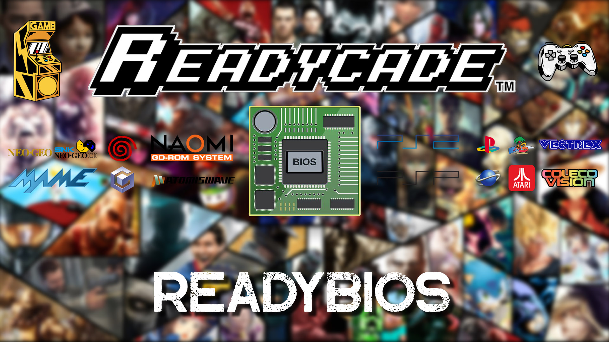

## ReadyBios
Browse your computer for a compatible Bios Pack and we'll do the rest!

## Click the Picture below to Watch the ReadyBios Tutorial

## INSTALLATION

### Windows 10/11, Linux and MacOS Supported

**Recalbox 9.0/9.1** Bios Packs **ONLY!**
(Must be a **supported** Bios Pack either **.zip** or **.7z** with **Recalbox** in the title)

### Remember to have your Ethernet Cable connected

### Screenshot of ReadyBios

